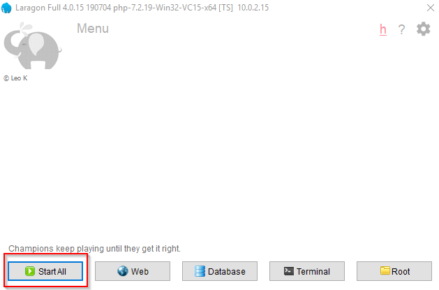
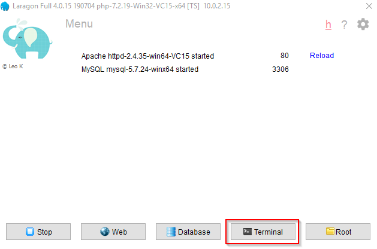
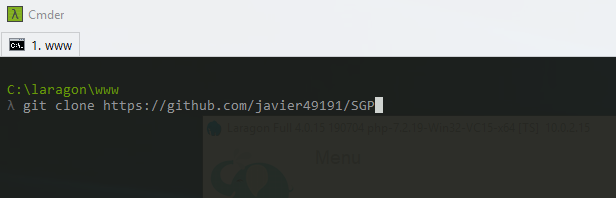
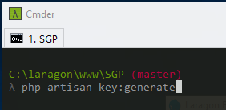
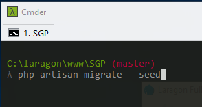
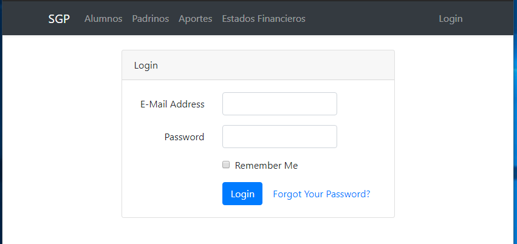

# Sistema de Gestión y Seguimiento de Padrinos SGP
Repositorio del TFP

Este es el repositorio para acceder al código de la aplicación y las instrucciones de cómo hacer una copia.

## Opción 1 🚀

#### Para acceder a una *demo* online click [aqui](https://tfgsgp.000webhostapp.com/ "aqui")  

Si se desea hacer una copia de forma local, ir a la opción 2

### Opción 2 🚀

_Estas instrucciones te permitirán obtener una copia del proyecto en funcionamiento en tu máquina local para propósitos de desarrollo y pruebas._

1. Descargar laragon (Full 130 MB) desde [aqui](https://laragon.org/download/ "aqui")  
Instalarlo y una vez finalizada la instalación, ejecutar el programa y hacer clck en la opción "Start all"  

2. Seleccionar la opción "Terminal" del programa y explorar el directorio c:\laragon\www 
Después ejecutar el siguiente comando:
git clone https://github.com/javier49191/SGP  

  
  

3. Luego ejecutar los siguientes comandos:  
cd SGP  
composer install  

4. Renombrar el acthivo "env.example" a ".env" y proveer la información de acceso a la base de datos (por defecto es root y sin contraseña)  
DB_CONNECTION=mysql  
DB_HOST=127.0.0.1  
DB_PORT=3306  
DB_DATABASE=sgp  
DB_USERNAME=_usuario de la base de datos_  
DB_PASSWORD=_Contraseña de la base de datos_  

5. Luego ejecutar en terminal el siguiente comando:  
php artisan key:generate  

  

6. Ir al administrador de base de datos y crear una nueva base de datos con el nombre *"sgp"*

7. Ejecutar el siguiente comando en terminal:  
php artisan migrate --seed  

  

8. Acceder a la aplicación utilizando la dirección http://sgp.test en cualquier explorador de internet  

  

9. Los usuarios para ingresar son:  

_secretaria@secretaria.com_
_secretaria123_

_encargado@encargado.com_
_encargado123_  

## Autor ✒️

* **Javier Gimenenz**  

## Gracias! 🤓

